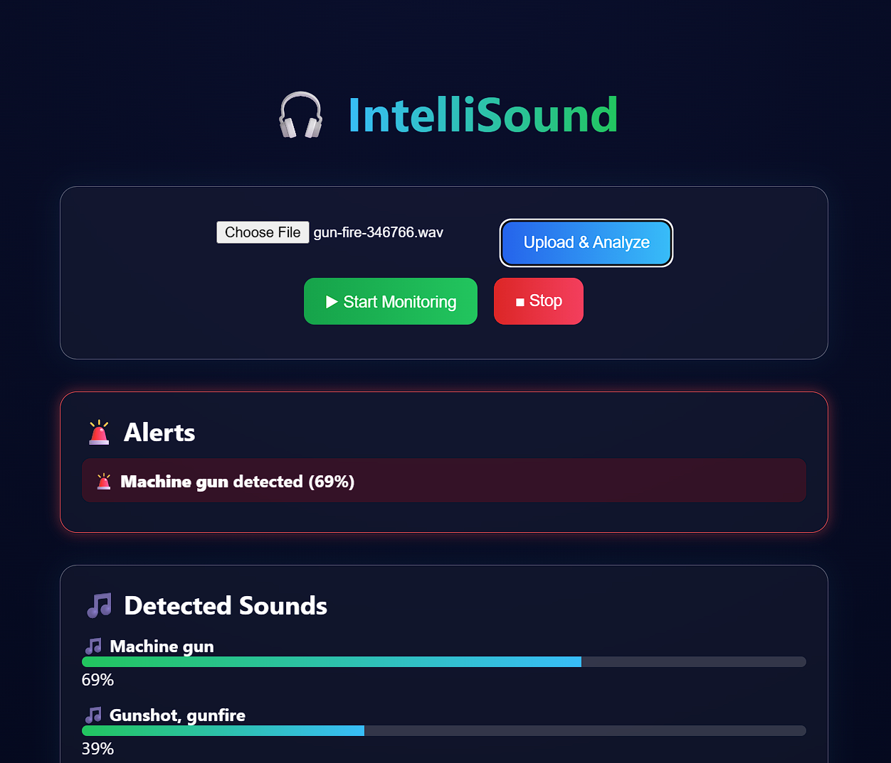
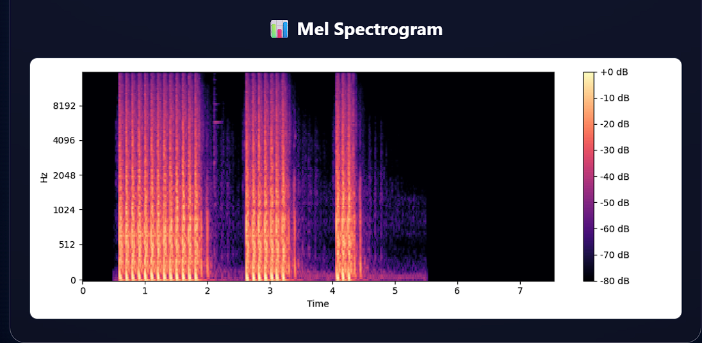

# 🎧 IntelliSound

### Real-Time Environment Sound Detection & Alert System

IntelliSound is an **AI-powered environmental sound monitoring system** designed to detect and classify real-world audio events in real time.
Using **Pretrained Audio Neural Networks (PANNs)** trained on the **AudioSet dataset**, the system continuously analyzes microphone input and detects sounds such as **gunshots, sirens, speech, alarms, and environmental noises**.

When a critical sound is detected, IntelliSound triggers **instant alerts and SMS notifications using Twilio**, making it useful for **public safety, surveillance, and smart monitoring applications**.

---

# 🚀 Key Features

### 🔊 Real-Time Audio Monitoring

Continuously captures audio from the system microphone and processes it in short time windows for real-time analysis.

### 🤖 Deep Learning Sound Recognition

Uses **PANNs (Pretrained Audio Neural Networks)** trained on **5000+ hours of AudioSet data** to identify environmental sounds with high accuracy.

### 🚨 Smart Alert System

Detects critical events like:

* Gunshots
* Sirens
* Fire alarms

When detected, the system automatically sends **SMS alerts using Twilio**.

### 📊 Interactive Visualization

The system provides a modern dashboard displaying:

* Sound detection confidence scores
* Progress bars for detected classes
* **Mel-Spectrogram visualization**
* Alert notifications

### 🗄 Event Logging

All detected sounds are stored in a **local SQLite database** for historical tracking and analysis.

### 💎 Modern Web Interface

A clean and responsive **glassmorphism-style UI** built with modern web technologies.

---

# 🧠 System Architecture

The IntelliSound system follows a modular pipeline:

1. **Audio Capture**

   * Browser captures audio using `MediaRecorder API`

2. **Audio Conversion**

   * Backend converts audio chunks using **FFmpeg**

3. **Deep Learning Inference**

   * Audio is processed using **PANNs models**

4. **Event Processing**

   * Results stored in **SQLite database**
   * Critical sounds trigger **SMS alerts**

5. **Visualization**

   * Dashboard displays:

     * sound probabilities
     * mel spectrogram
     * alerts

---

# 🛠 Tech Stack

## Backend

* Python
* Flask
* PyTorch
* PANNs (Pretrained Audio Neural Networks)
* Librosa
* FFmpeg
* SQLite
* Twilio API

## Frontend

* HTML5
* CSS3 (Modern UI / Glassmorphism)
* JavaScript
* MediaRecorder API

## AI / Audio Processing

* PyTorch
* Librosa
* AudioSet Dataset
* Mel-Spectrogram Analysis

---

# 📂 Project Structure

```
real-time-environment-sound-detection-with-alert-system
│
├── backend
│   ├── app.py
│   ├── alert_engine.py
│   ├── config.py
│   └── events.db
│
├── frontend
│   ├── index.html
│   ├── style.css
│   └── script.js
│
├── screenshots
│   ├── dashboard.png
│   ├── spectrogram.png
│   └── detection_results.png
│
├── requirements.txt
├── LICENSE
└── README.md
```

---

# ⚙️ Installation Guide

## 1️⃣ Clone the Repository

```bash
git clone https://github.com/gkusahljain/real-time-environment-sound-detection-with-alert-system.git
cd real-time-environment-sound-detection-with-alert-system
```

---

## 2️⃣ Install Dependencies

```bash
pip install -r requirements.txt
pip install panns_inference
```

---

## 3️⃣ Install FFmpeg

### Windows

```
choco install ffmpeg
```

### Ubuntu / Debian

```
sudo apt install ffmpeg
```

---

## 4️⃣ Configure Twilio Credentials

Edit:

```
backend/alert_engine.py
```

Add your credentials:

```python
ACCOUNT_SID = "your_twilio_sid"
AUTH_TOKEN = "your_twilio_auth_token"
FROM_NUMBER = "your_twilio_phone_number"
TO_NUMBER = "destination_phone_number"
```

---

# ▶️ Running the Project

## Start Backend Server

```bash
cd backend
python app.py
```

Server runs at:

```
http://127.0.0.1:8000
```

---

## Start Frontend

Open:

```
frontend/index.html
```

or run **Live Server** in VS Code.

---

# 🎙 How It Works

1. Click **Start Monitoring**
2. Browser captures audio from microphone
3. Audio is sent to backend in small chunks
4. PANNs model analyzes sound
5. System returns classification results
6. Critical sounds trigger **Twilio SMS alerts**

---

# 📸 Screenshots

## IntelliSound Dashboard



## Mel Spectrogram Visualization



## Sound Detection Results


---

# 📊 Example Detected Sounds

| Sound Type     | Confidence |
| -------------- | ---------- |
| Speech         | 89%        |
| Telephone Ring | 75%        |
| Gunshot        | 69%        |
| Indoor Noise   | 24%        |

---

# 📜 License

This project is licensed under the **MIT License**.

See the LICENSE file for more details.

---

# 🤝 Acknowledgements

Special thanks to:

* **Qiuqiang Kong** for the PANNs model implementation
* **Google AudioSet** dataset researchers
* **PyTorch community**

---

# 👨‍💻 Author

** G Kushal Jain**

RV College of Engineering
Bangalore, India

GitHub
https://github.com/gkusahljain

---

⭐ If you find this project useful, consider giving it a **star on GitHub**.
